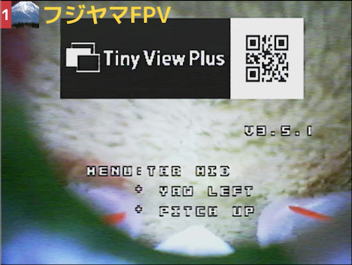
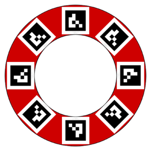
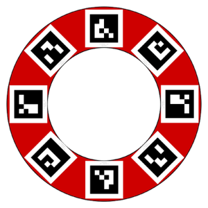

# Tiny View Plus

[English version](./README_en.md)

Tiny View Plusは、FPV映像を手軽に表示するためのアプリです。UVC対応の受信機を、MacBook等のコンピューターに接続して使用します。受信機は4台まで(※)接続できます。


**(※)Windowsの場合、USBハブに複数の受信機を接続すると正しく動作しません。PC本体のUSBポートに1つにつき、受信機1台のみを接続してください。**

## 動作環境

<table>
<tr>
<td>OS</td><td>macOS (Mojave推奨)<br/>Windows (10 64bit推奨)</td>
</tr>
<tr>
<td>受信機</td><td>Eachine ROTG02<br/>Eachine ROTG01</td>
</tr>
</table>

冒頭の写真の例では、USBハブ(C-A)とUSBケーブル(A-microB)を別途用意しています。この場合、ROTG付属のUSBケーブル(OTG用microB-microB)は使用しません。

ソースコードからビルドする場合には [openFrameworks](http://openframeworks.cc/ja/) v0.10.1 が必要です。openFrameworksが対応している他のOS(Ubuntu等)でも動作する可能性はありますが、未検証です。

## インストール

### ビルド済みバイナリを使用する場合(通常はこちら)

1. [リリースページ](https://github.com/t-asano/tinyviewplus/releases)よりzipファイルをダウンロード
2. zipファイルを展開して適当な場所に配置

**macOSの場合、必ず「アプリケーション」フォルダの下に配置してください。それ以外の場所に配置すると、ファイルの書き込みを伴う機能が正しく動作しません。**


バイナリの作成にあたっては細心の注意を払っていますが、アプリを実行することで起こる不具合については、一切責任を負いません。

### ソースコードからビルドする場合(上級者向け)

1. [openFrameworks](http://openframeworks.cc/ja/) v0.10.1 をインストール
2. アドオンをインストール
```
$ cd addons/
$ git clone -b fix-of_v0.10 https://github.com/t-asano/ofxTrueTypeFontUC.git
$ git clone https://github.com/t-asano/ofxAruco
$ git clone https://github.com/kylemcdonald/ofxCv
$ git clone https://github.com/t-asano/ofxZxing.git
```
3. プロジェクトジェネレーターで、以下のアドオンを含むプロジェクトを作成
	- ofxOsc
	- ofxTrueTypeFontUC
	- ofxAruco
	- ofxCv
	- ofxOpenCv
	- ofxPoco
    - ofxZxing
4. Tiny View Plusのソースコード(src/)とアセット(bin/data/)を上書き
5. ビルド

## 使い方

### 起動

1. コンピューターに受信機(4台まで)を接続
2. アプリ本体をダブルクリックして起動

### 受信機の検出

受信機がうまく検出されない場合は、以下をお試し下さい。

1. アプリを終了
2. 受信機を全て外す
3. USBハブ使用の場合はそれを接続し直す、または撤去する
4. 受信機を一台ずつ数秒間隔で接続
5. アプリを起動

macOSの場合、QuickTimeアプリでカメラ(受信機)のリストを表示できます。Tiny View Plusを実行する前にカメラの検出状況を確認しておくと、問題の切り分けがしやすくなります。USBハブを使用していて映像がコマ落ちするようなら、USBハブ1台あたりの受信機の数を2台以下を目安に減らしてください。

Windowsでは、デバイスマネージャーでカメラ(受信機)の検出状況を確認できます。なお、一つのUSBハブに複数の受信機を接続した場合に、そのうち1台しか動作しないことがあります。この場合、USBハブを経由せずに接続すれば改善することがあります。

### キー操作

| キー | 機能 | 初期値 |
|---|---|---|
| H | ヘルプの表示 | - |
| 1~4 | カメラ1~4のソロ表示のオン/オフ | オフ |
| T | カメラのトリミングのオン/オフ(※1) | オフ |
| Shift + 1~4 | カメラ1~4の表示のオン/オフ | オン |
| Q | QRコードリーダーの開始/停止(※2) | - |
| B | 背景画像の変更 | アプリ内蔵の画像 |
| F | フルスクリーン表示のオン/オフ | オフ |
| A | ARラップタイマーのモード変更(ノーマル/ルーズ/オフ)(※3) | オン |
| O | ロックオンエフェクトのオン/オフ(※4) | オフ |
| Space | レースの開始/終了 | - |
| V | レースの結果の表示(※5) | - |
| D | レースの制限時間(1\~3600秒)、周回数(1\~100)の設定 | 制限なし、10 |
| M | 最小ラップタイムの設定(1~100秒) | 3秒 |
| N | タイム読み上げ言語の変更(日本語/英語) | 日本語 |
| S | OSC経由での音声読み上げのオン/オフ | オフ |
| I | 設定の初期化 | - |
| . | アプリの終了 | - |

- (※1)カメラが1台または3台の場合に、映像の一部をトリミングして大きく表示します
- (※2)QRコードから読み取った文字列をカメラのラベルに設定します
- 背景画像は、画面に合わせて拡大縮小され、左上が優先表示されます
- (※3)ルーズモードでは、ゲートの外側を通過しても計測対象となります
- (※4)ゲート通過タイムの差が1秒未満の場合に、追跡する側のカメラを拡大表示します
- (※5)レースの結果は、レース終了時に既定フォルダ内へも出力されます
	- macOSバイナリ版: Tiny View Plus.app/Contents/Resources/data/results
	- それ以外: data/results
- アプリを終了すると設定は消去されます
- カメラの音声は出力されません

### マウス操作

一部の機能は、マウスで操作できます。

| クリック箇所 | 機能 |
|---|---|
| カメラ1~4のアイコン | カメラ1~4のアイコンの変更(※1) |
| カメラ1~4のラベル | カメラ1~4のラベルの変更(※２) |

- (※1)カメラのアイコンを変更すると、ラベルが自動的に変更されます
	- アイコンのファイル名(拡張子を除く)が採用されます
- (※2)カメラのラベルを変更すると、アイコンが自動的に変更されます
	- 既定フォルダ内に、ラベル文字列.png または ラベル文字列.jpg という画像ファイルが見つかると、この優先順でアイコン画像として採用されます
		- macOSバイナリ版: Tiny View Plus.app/Contents/Resources/data/pilots
		- それ以外: data/pilots
	- 画像ファイルが見つからない場合は、デフォルトアイコンが採用されます
	- 縦横比は強制的に1:1となります

### QR code reader

QRコードを使用して、カメラのラベルを設定できます。



QRコードを作成するには、Google Charts APIが利用できます。以下は、QRコードを作成するためのURLの例です。

[https://chart.apis.google.com/chart?cht=qr&chs=500x500&chl=TinyViewPlus](https://chart.apis.google.com/chart?cht=qr&chs=500x500&chl=TinyViewPlus)

QRコードをOSDに組み込んでおくと便利です。以下は、Betaflight用のロゴ画像の例です。


### ARラップタイマー

ARマーカーを利用して、ラップタイムを計測できます。




マーカーを4から8個程度、ゲートの周囲に配置してください。またその際に、マーカーの上側がゲートの中央を向くようにしてください。以下の4種類のマーカーに対応していますが、上の図のように1種類のみを配置する形でも構いません。

- [marker_00_main_a.png](docs/marker_00_main_a.png)
- [marker_01_main_b.png](docs/marker_01_main_b.png)
- [marker_02_main_c.png](docs/marker_02_main_c.png)
- [marker_03_main_d.png](docs/marker_03_main_d.png)

マーカーのサイズは1辺150mmを目安として、通過スピードに応じて調整してください。ハイスピードレースにおいては、より大きなマーカーが適しています。マーカーの認識がうまくいかない場合は、マーカーを大きくしたり、複数の種類を織り交ぜたり、より明るい場所に設置すると、改善するかもしれません。

ラップタイムの計測は、レース中にのみ行われます。同時に2個以上の正しい向きのマーカーを検出した後、画面からマーカーが消えたタイミングでラップタイムが確定します。ただし、最後に映っていたマーカーの向きが正しくない(ゲートの外側を通った等の)場合は、計測の対象外となります。

環境によっては、マーカーの認識処理が重く、動作に支障があるかもしれません。その場合は、機能を無効化してください。

## OSCによる制御

OSCプロトコルにより外部からの制御が可能です。UDP4000番ポートでOSCパケットを受信します。

### メッセージフォーマット

#### カメラのソロ表示

/v1/camera/{id}/solo {switch}

- パラメーター
    - id ... 1～4の数値
    - switch ... "on" または "off"
- [例]カメラ1をソロ表示する
    - /v1/camera/1/solo "on"

#### カメラの表示/非表示

/v1/camera/{id}/display {switch}

- パラメーター
    - id ... 1～4の数値
    - switch ... "on" または "off"
- [例]カメラ1を非表示とする
    - /v1/camera/1/display "off"

#### カメラのラベルの変更

/v1/camera/{id}/label {label}

- パラメーター
    - id ... 1～4の数値
    - label ... 任意の文字列(パイロット名など)
- [例]カメラ2のラベルを"Whooper2"とする
    - /v1/camera/2/label "Whooper2"

ラベルの変更と連動して、アイコンも自動的に変更されます。

- macOSバイナリの場合は "Tiny View Plus.app/Contents/Resources/data/pilots" フォルダの下、それ以外の場合は "data/pilots" フォルダの下に、{label}.png または {label}.jpg という画像ファイルが見つかると、この優先順でアイコン画像として採用します
- 画像ファイルが見つからない場合は、デフォルトアイコンが採用されます
- 縦横比は強制的に1:1となります

#### カメラのラップタイムの更新

/v1/camera/{id}/laptime {time}

- パラメーター
    - id ... 1～4の数値
    - time ... ラップタイムを示す数値(秒)
- [例]カメラ3のラップタイムを128秒64とする
    - /v1/camera/3/laptime 128.64
- [例]カメラ4のラップタイムをクリアする
    - /v1/camera/4/laptime 0

#### 音声読み上げ

/v1/speech/{language}/say {text}

- パラメーター
    - language ... "en"(英語)または"jp"(日本語)
    - text ... 読み上げる文
- [例]日本語で"ドローンで遊ぼう"と読み上げる
    - /v1/speeech/jp/say "ドローンで遊ぼう"

## License

Tiny View Plus is distributed under the MIT License. This gives everyone the freedoms to use Tiny View Plus in any context: commercial or non-commercial, public or private, open or closed source. Please see [LICENSE.md](LICENSE.md) and [LICENSE\_THIRD\_PARTY.md](LICENSE_THIRD_PARTY.md) for details.