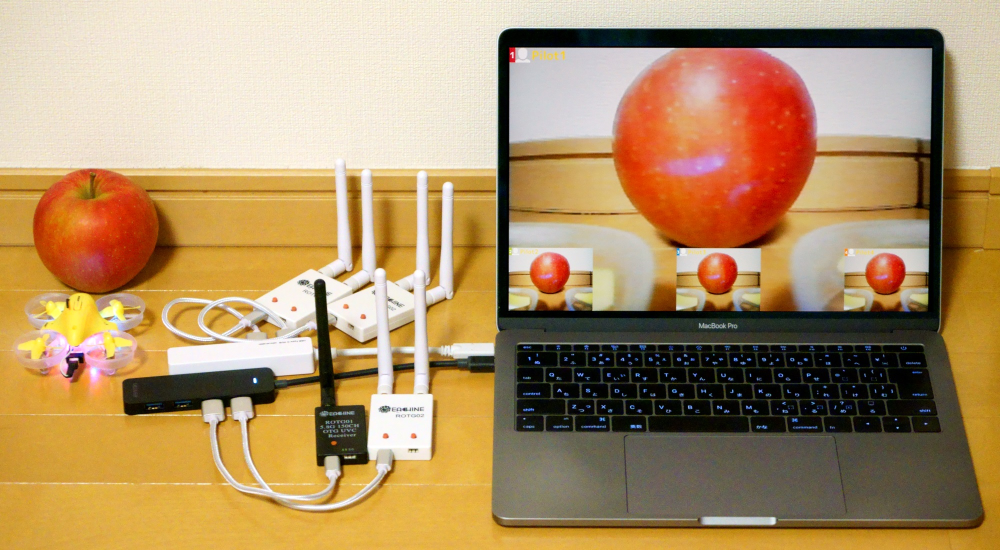
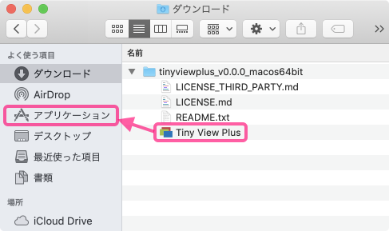

# Tiny View Plus

Tiny View Plus is an application to display FPV video easily with USB receivers. Up to 4 receivers(\*) can be connected.

**(\*)On Windows, it is impossible to connect multiple receivers to the USB hub. Please connect only one receiver to each USB port built in PC.**

## Environment

<table>
<tr>
<td>OS</td><td>macOS (Mojave is recommended) Windows (10 64bit is recommended)</td>
</tr>
<tr>
<td>FPV Receiver</td><td>Eachine ROTG02 Eachine ROTG01</td>
</tr>
</table>

To build from source code, [openFrameworks](http://openframeworks.cc/ja/) v0.10.1 is required.

## Install

Attention: We are not responsible for any problems caused by running the application.

If you want to build from source code, please refer to [this document](docs/HowToBuild_en.md).

### macOS

1. Download a zip file from [Release page](https://github.com/t-asano/tinyviewplus/releases).
2. Extract it and place its contents in the proper place.
    - Be sure to put the application under the "Application" folder. If you place it anywhere else, functions that writing to file will not work correctly.
    

### Windows

1. Download a zip file from [Release page](https://github.com/t-asano/tinyviewplus/releases).
2. Extract it and place its contents in the proper place.
3. Install [Microsoft Visual C++ 2015 Redistributable(vc_redist.x64.exe)
](https://www.microsoft.com/ja-jp/download/details.aspx?id=53587)(Only if VCOMP140.DLL error occurs at startup.)

## Usage

### Launch

1. Connect receivers(Up to 4) to computer.
2. Launch application.

### Detection of receivers

If receivers are not successfully detected, please try following operation.

1. Exit the application.
2. Remove all receivers.
3. If using a USB hub, reconnect it or remove it.
4. Connect receivers one by one at intervals of several seconds.
5. Launch the application.

On macOS, you can check a list of cameras (receivers) with the QuickTime. If you are using a USB hub and the picture drops, please reduce the number of receivers per USB hub.

On Windows, you can check the detection status of the camera (receiver) with the device manager. In addition, if multiple receivers are connected to same USB hub, only one of them may operate.

### Keyboard operations

#### System

| key | Function | Default value |
|---|---|---|
| N | Set speech language (Japanese/English) | Japanese |
| H | Display help (Settings/Commands) | - |
| I | Initialize settings | - |
| .(period) | Exit application | - |

#### Display

| key | Function | Default value |
|---|---|---|
| F | Set fullscreen mode (on/off) | off |
| T | Set camera view trimming (on/off) (\*1) | off |
| 1~4 | Set camera 1~4 enhanced view (on/off) | off |
| Ctrl + 1~4 | Set camera 1~4 view (on/off) | on |
| B | Set background image (\*2) | built-in image |
| Q | Start/Stop QR Code reader for camera label (\*3) | - |

- (\*1) When 1 or 3 cameras are connected, the image will be cropped and displayed as large as possible.
- (\*2) Sets the characters scanned from the QR Code to the camera label.
- (\*3) The background image is scaled according to the screen, and the upper left is displayed in priority.

#### Race

| key | Function | Default value |
|---|---|---|
| A | Set AR lap timer mode (normal/loose/off) (\*1) | normal |
| D | Set race duration time (0\~36,000s) and laps (1\~10,000) | 0s (no limit), 10 laps |
| M | Set minimum lap time (1~100s) | 3s |
| L | Set lap history during race (on/off) | off |
| Space | Start/Stop race | - |
| 5~8 | Add lap at camera 1~4 | - |
| Ctrl + 5~8 | Delete previos lap at camera 1~4 | - |
| R | Display race results (\*2) | - |

- (\*1) In loose mode, lap time will be measured even if the drone passes outside the gate.
- (\*2) Race results will be saved under predefined folder when race finish.
	- macOS binary: Tiny View Plus.app/Contents/ Resources/data/pilots
	- others: data/pilots

#### Attention

- When you exit the application, the settings will be initialized.
- Camera audio is not supported.

### Mouse operations

Some functions can also be operated with the mouse.

| Operation | Function |
| --- | --- |
| Click camera 1~4 icon | Change icon (\*1) |
| Click camera 1~4 label | Change label (\*2) |

- (\*1) Camera label will be automatically changed according to changing camera icon.
	- The file name of the icon (excluding the extension) will be adopted.
- (\*2) Camera icon will be automatically changed according to changing camera label.
	- If {label string}.png or {label string}.jpg was found under predefined folder, it will be adopted as an icon image in this priority order.
		- macOS binary: Tiny View Plus.app/Contents/ Resources/data/pilots
		- others: data/pilots
	- If no image file is found, the default icon will be adopted.
	- The aspect ratio is forced to 1:1.

### QR Code for label setting

You can set the camera label by the QR Code.

You can use Google Charts API to create QR Code. An example of URL is as follows.

[https://chart.apis.google.com/chart?cht=qr&chs=500x500&chl=TinyViewPlus](https://chart.apis.google.com/chart?cht=qr&chs=500x500&chl=TinyViewPlus)

It is convenient to embed the QR Code in the OSD. An example of an image for the Betaflight is as follows.

\* "QR Code" is a registered trademark of DENSO WAVE INCORPORATED.

### AR lap timer

You can measure the lap time by using AR marker.

Please place 4 to 8 markers around the gate. Also make sure that the top of the marker faces the center of the gate. Following four types of markers are supported. It does not matter if only one type is placed as shown above.

- [marker_00_main_a.png](docs/img/marker_00_main_a.png)
- [marker_01_main_b.png](docs/img/marker_01_main_b.png)
- [marker_02_main_c.png](docs/img/marker_02_main_c.png)
- [marker_03_main_d.png](docs/img/marker_03_main_d.png)

The size of the marker should be 150mm per side. Larger marker will be suitable for high speed race. If marker recognition is not successful, please try increasing the size of the marker, using multiple types, or placing them in a brighter place.

Lap time will be measured only during the race. After detecting two or more correctly oriented markers simultaneously, when the marker disappears from the screen, lap time will be confirmed. However, if the direction of the last displayed marker is incorrect, the measurement will be canceled.

Depending on the environment, recognition processing of markers might be heavy. In that case, please disable the function.

## OSC API

Tiny View Plus can be controlled by OSC protocol. Detailed information is [here](docs/OSCAPI_en.md).

## License

Tiny View Plus is distributed under the MIT License. This gives everyone the freedoms to use Tiny View Plus in any context: commercial or non-commercial, public or private, open or closed source. Please see [LICENSE.md](LICENSE.md) and [LICENSE\_THIRD\_PARTY.md](LICENSE_THIRD_PARTY.md) for details.